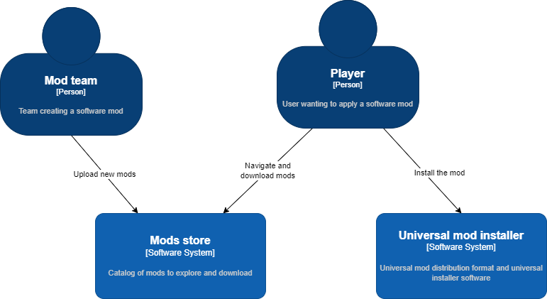

# Multi-platform Open eXtensible Mod Installer

Multi-platform framework for distributing and installing mods of a software
product such as a video-game.

> [!CAUTION]  
> This project is still in a very early phase. It doesn't have any deliverables
> yet. No guarantees it will be ever finished.

- 📚 Specification of formats for distributing modding projects and installers.
- ♻️ Multi-platform mod distribution.
- 🔌 Extensible format.
- 🔒 Security features.
- 💻 Software libraries and tools to create and apply the mods.



## Supported target platforms

Platform support status:

| Platform | Specification | Installer | Builder |
| -------- | ------------- | --------- | ------- |
| Generic  | 🚧            | ❌        | ❌      |
| DS       | 🚧            | ❌        | ❌      |
| DSi      | 🚧            | ❌        | ❌      |

## Get started

The format specification is available at the
[project documentation website](https:/pleonex.dev/game-patcher/index.html).

Feel free to ask any question in the
[project discussions](https://github.com/pleonex/game-patcher/discussions).

## Build

The build system requires an installation of the .NET 8.0 SDK.

To build, test and generate artifacts run:

```sh
# Build
dotnet run --project build/orchestrator

# (Optional) Create bundles
dotnet run --project build/orchestrator -- --target=Bundle
```

## Release

Create a new GitHub release with a tag `v{Version}` (e.g. `v2.4`) and that's it!
This triggers a pipeline that builds and deploy the project.

## Credits

The PoC desktop application uses the following resources:

- [Installer background](https://lottiefiles.com/free-animation/space-areal-7SSbLRDxnS)
