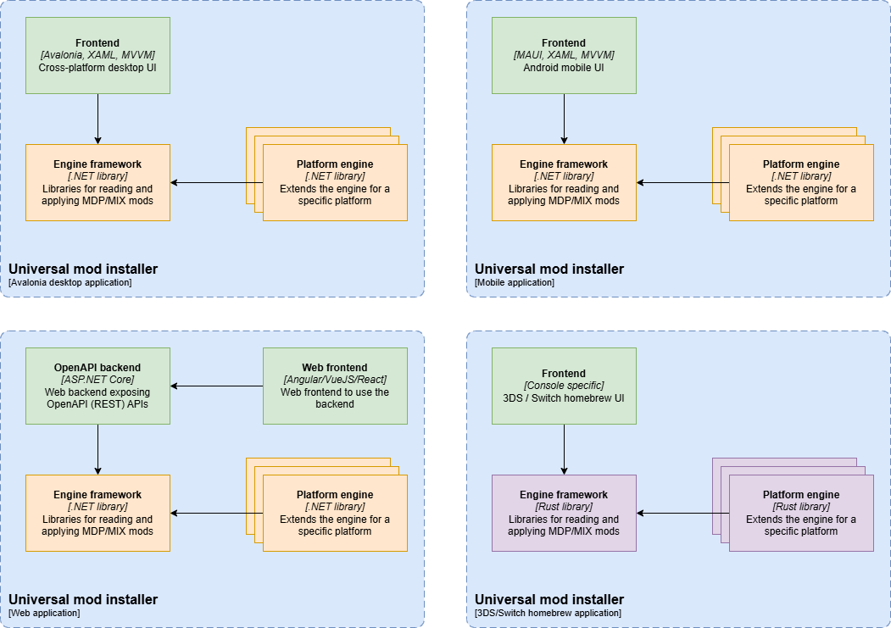

# Design: mod installer

## Context

The _MOXMI_ project aims to provide an open and unique solution to distribute
and apply mods on software products. See the project
[introduction](../../index.md) for more details on the project.

The mod installer focus on applying the standard MOD format into a software
product.

### User stories

TODO: user stories in "AS A/I WANT/SO THAT" format or requirement list.

### State of the art

There are several projects that aimed at providing a unique installer for mods.
Most of them focus on a single platform. See the
[goals reference](../specs/goals.md#references) section for more details.

## Architecture

The architecture consists on an application that can apply a mod. The design
concept is based on two concepts: multi-platform and cross-patching.

### Multi-platform

The core engine can run from multiple operative systems. Creating a native
installer application to run on a platform would only require to create or adapt
a frontend.

The base engine will use .NET technology as there are
[known .NET libraries](https://github.com/SceneGate/) supporting already the
first target platforms. .NET will also allow creating relatively easy mobile and
web applications.

As .NET can't run everywhere, a second engine based on Rust may be created. Set
of platforms planned to run the installer application(s).

| Engine / OS | Windows | Linux | macOS | Android | iOS | 3DS |
| ----------- | ------- | ----- | ----- | ------- | --- | --- |
| .NET        | ✔️      | ✔️    | ✔️    | ✔️      | ❌  | ❌  |
| Web REST    | ✔️      | ✔️    | ✔️    | ✔️      | ✔️  | ❌  |
| Rust        | ❌      | ❌    | ❌    | ❌      | ❌  | ✔️  |

### Cross-patching

The core engine can apply a mod for a software that will run on a different
platform. For instance, installing a mod for a DS game from an Android device.

Set of target platforms planned to support on each engine.

| Engine / Target platform | NDS | DSi | 3DS | Wii | Steam |
| ------------------------ | --- | --- | --- | --- | ----- |
| Windows (.NET)           | ✔️  | ✔️  | ✔️  | ✔️  | ✔️    |
| Linux (.NET)             | ✔️  | ✔️  | ✔️  | ✔️  | ✔️    |
| macOS (.NET)             | ✔️  | ✔️  | ✔️  | ✔️  | ❌    |
| Android (.NET)           | ✔️  | ✔️  | ✔️  | ✔️  | ❌    |
| Web (REST)               | ✔️  | ✔️  | ✔️  | ❌  | ❌    |
| 3DS (rust)               | ✔️  | ✔️  | ✔️  | ❌  | ❌    |

## High level components

There are three main components:

- Engine: multi-platform development libraries implementing reading, creating
  and applying mods.
- Platform extension: extend the engine for a target platform.
- Frontend: user applications that use the _engine_ libraries to either apply a
  mod or create a new one.

### Engine framework

TODO: list components and brief description

### Platform extension libraries

TODO: describe and small diagram

## Frontend

### UI

TODO: wireframe and design pages

### Frontend components

TODO: diagram showing XAML, MVVM with navigator and configuration

## Extensibility

The engine framework will provide many extension points for platform specific
implementations. It will have public APIs to register the platform extension
implementations.

There are no plans to support a plugin-like discovery feature as it may result
in vulnerabilities. The installer will need to be recompiled to support a new
platform or specific software.

## Deployment

### Installation

- Desktop application:
  - Portable in ZIP file
  - WinGet package distribution
- Mobile:
  - APK from GitHub release page
  - Open app stores to be considered

### Upgrade

It's not in the initial plan to provide a built-in upgrade feature. However, it
will query the GitHub release API to notify user when there are new versions of
the installer application.

### Configuration

The desktop application will store user preferences in a local file in the user
application directory. It will use a custom implementation with a JSON file.

The mobile application will use the MAUI built-in APIs to store preferences.

### Monitoring

No monitoring will be implemented.

### Logging

Logging will be a key feature for troubleshooting issues when applying mods.

The .NET engine will write logs using the Microsoft logging interface.

The desktop application will integrate with NLog for persisting logs on the file
system. It will configure archiving policies to not have log files bigger than
20 MB.

## Implementation

### Phases

1. 🚧 [core + DS] read and apply MIX mods
   1. read MIX format with compatibility validation
   2. apply of xdelta patches
   3. bundle and deployment of mod games
2. [UI] Desktop application for Windows, Linux, and macOS
   - Instructions to prepare software for modding
   - Validate hardware compatibility
   - Backup software
3. [core + desktop] read MDP format, update version and fetch remote resources
4. [core] security features: signature verification and encryption
5. [ext-3ds] 3DS extensions
6. [ext-pc] Steam extensions
7. [android] Mobile application for Android
8. [rust] Port core libraries to Rust language
9. [UI] 3DS homebrew based on Rust engine
