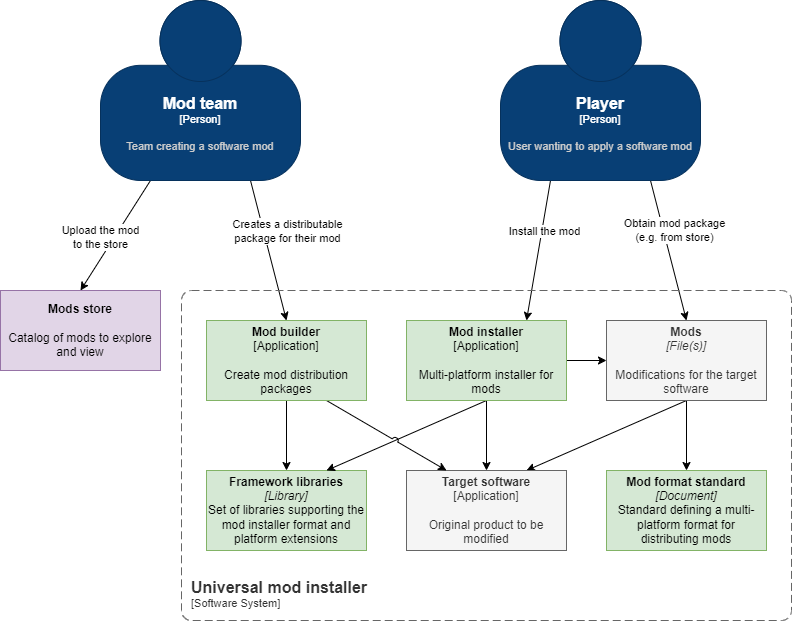
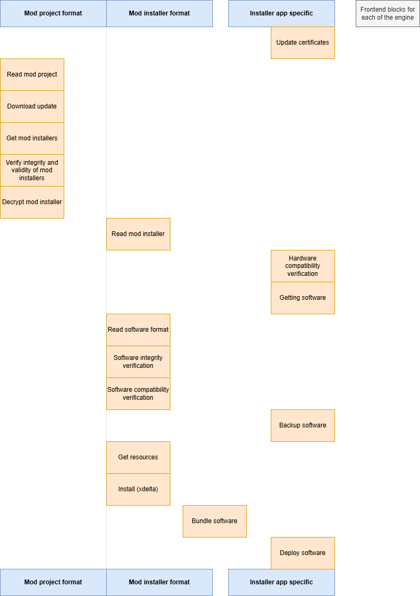

# Design: mod installer

## Context

The _MOXMI_ project aims to provide an open and unique solution to distribute
and apply mods on software products. See the project
[introduction](../../index.md) for more details on the project.

The mod installer focus on applying the standard MOD format into a software
product.

### User stories

TODO: user stories in "AS A/I WANT/SO THAT" format or requirement list.

### State of the art

There are several projects that aimed at providing a unique installer for mods.
Most of them focus on a single platform. See the
[goals reference](../specs/goals.md#references) section for more details.

## High level components

TODO: C4 L3 diagram with engine + frontend blocks

### Engine framework

TODO: list blocks and brief description

### Platform extension libraries

TODO: describe and quick diagram

## Frontend

### UI

TODO: diagram with the UI design

### Frontend components

TODO: related components for the frontend side.

## Extensibility

The engine framework will provide many extension points for platform specific
implementations. It will have public APIs to register the platform extension
implementations.

There are no plans to support a plugin-like discovery feature as it may result
in vulnerabilities. The installer will need to be recompiled to support a new
platform or specific software.

## Deployment

### Installation

- Desktop application:
  - Portable in ZIP file
  - WinGet package distribution
- Mobile:
  - APK from GitHub release page
  - Open app stores to be considered

### Upgrade

It's not in the initial plan to provide a built-in upgrade feature. However, it
will query the GitHub release API to notify user when there are new versions of
the installer application.

### Configuration

The desktop application will store user preferences in a local file in the user
application directory. It will use a custom implementation with a JSON file.

The mobile application will use the MAUI built-in APIs to store preferences.

### Monitoring

No monitoring will be implemented.

### Logging

Logging will be a key feature for troubleshooting issues when applying mods.

The .NET engine will write logs using the Microsoft logging interface.

The desktop application will integrate with NLog for persisting logs on the file
system. It will configure archiving policies to not have log files bigger than
30 MB.

## Implementation

### Phases

1. [core] read MIX format and apply generic mod resources
   - Initial support for DS format extension
2. [core + DS] validate software compatibility and integrity
3. [UI] Desktop application for Windows, Linux, and macOS
4. [core] read MDP format and update and fetch remote resources
5. [core] security features: signature verification and encryption
6. [ext-3ds] 3DS extensions
7. [ext-pc] Steam extensions
8. [android] Mobile application for Android
9. [rust] Port core libraries to Rust language
10. [UI] 3DS and Switch homebrews based on Rust engine
