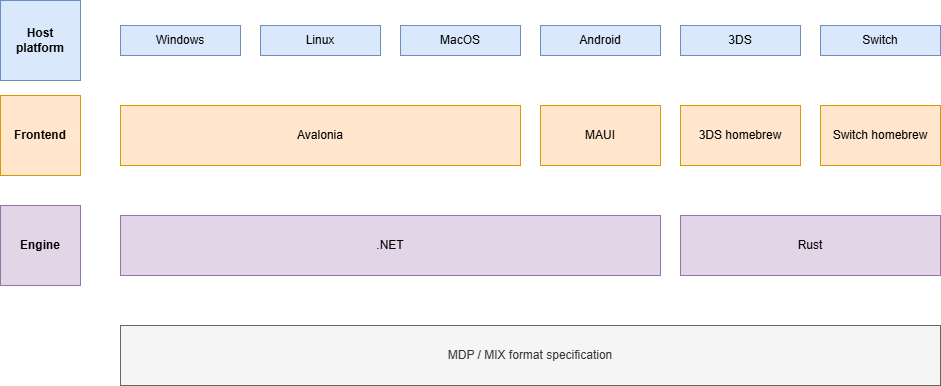

# MOXMI universal installer

> [!CAUTION]  
> The applications and libraries do not exist yet. This is just the plan.

The _MOXMI universal installer_ is a set of applications and development
frameworks for using the _MOXMI standard mod format_.

- 1️⃣ One application for applying mods of any software platform
- 📱 Apply mods from any platform
- 🔠 Localized to the user language
- 🆓 Open-source and free. Community-driven.

<!-- Future: add screenshot of installer and builder -->

## Projects

There are two main components:

- Engine: multi-platform development libraries implementing reading, creating
  and applying mods.
- Frontend: user applications that use the _engine_ libraries to either apply a
  mod or create a new one.

## Multi-platform

The engine is multi-platform: the libraries run from multiple operative systems.
A frontend application will adapt the user experience of the application to each
platform.

| Engine / OS | Windows | Linux | macOS | Android | iOS | 3DS   | Switch |
| ----------- | ------- | ----- | ----- | ------- | --- | ----- | ------ |
| .NET        | ✔️      | ✔️    | ✔️    | ✔️      | ❌  | Maybe | Maybe  |
| Web REST    | ✔️      | ✔️    | ✔️    | ✔️      | ✔️  | ❌    | ❌     |
| Rust        | Maybe   | Maybe | Maybe | ❌      | ❌  | ✔️    | ✔️     |

## Cross-patching

The engine is also oriented to support _cross-patching_: apply a mod on a
software from a different platform than the one running. For instance, apply a
mod for a DS game from an Android device.

| Engine / Target platform | NDS | DSi | 3DS | Switch | Steam | PSX |
| ------------------------ | --- | --- | --- | ------ | ----- | --- |
| Windows (.NET)           | ✔️  | ✔️  | ✔️  | ✔️     | ✔️    | ✔️  |
| Linux (.NET)             | ✔️  | ✔️  | ✔️  | ✔️     | ✔️    | ✔️  |
| macOS (.NET)             | ✔️  | ✔️  | ✔️  | ✔️     | ❌    | ✔️  |
| Android (.NET)           | ✔️  | ✔️  | ✔️  | ❌     | ❌    | ✔️  |
| Web (REST)               | ✔️  | ✔️  | ✔️  | ❌     | ❌    | ❌  |
| 3DS (rust)               | ✔️  | ✔️  | ✔️  | ❌     | ❌    | ❌  |
| Switch (rust)            | ✔️  | ✔️  | ✔️  | ✔️     | ❌    | ✔️  |
