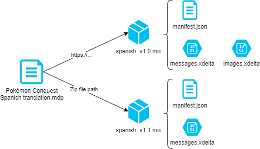

# Specification overview

This project introduces new formats to distribute mods of a given product such
as a video-game. At this moment the distribution of mods is mostly based on
publishing a file with a binary diff and a _readme_ file describing the
installation steps and supported software. Some groups that are lucky to have a
developer in their group may be able to create a _patcher_, a specific software
to apply the mod on the game.

The main goal of the new format is to provide a shared solution for mods that
works for most of the cases: one format for applying mods games of every console
and from any platform.

There are two main formats:

- **Modding project manifest** (`.modproj`, `.mdp`): text file describing a
  modding project. It contains information of the game and lists the different
  mod versions available of the project.
- **Mod installer eXtensible** (`.mix`): container with the resources of the mod
  and a text file describing the automatic installation process.

## Goals

This section describes some goals taken into account when designing the formats.

> [!NOTE]  
> Some requirements are problems with no solution, unless we enter the same
> dynamic of some game companies including DRM practices, which we are against.
> But we can try to apply some basic checks to make it difficult to people
> without the enough level of maturity not wanting to play fair in the scene.

### Multi-platform mods

> Every platform is its own world, but at a very basic level, modding relies on
> replacing game files. A simple, common format makes a rich modding ecosystem
> of compatible website stores and tooling.

The formats should support mods from different platforms. They should have
extensible points and should not assume any logic regarding the installation or
content of the mod resources.

The only assumption is that the outcome after applying the mod is one or more
files. It does not support patching a running game, memory modifications or
hooks.

> [!NOTE]  
> Some platforms have advance requirements where a simple patching mechanism
> would not work. This may be the case of modern PC games. For those case, it
> should be possible to distribute the mods, to then use specialized software
> for its installation. The mod may also create the required configuration files
> for a custom firmware or launcher.

### Multi-platform applications

> Mobile hardware is enough powerful at this day to play old games via
> emulators. It should be possible to apply a mod from an Android device
> directly.

The format should be based on standard technologies and formats. It should be
possible to create a mod manager or patcher for any operative system.

### Preservation of modding projects

> Some mods for very old games are hard to apply because they are based on
> custom software that only runs in early versions of Windows. Even when the
> game can be emulated from a modern computer, it's hard to apply the mod.

> Teams disappear. Websites shutdown. A single file that contains all the mod
> resources and instructions.

The format offers the possibility to have all the required files of the mod.
Preserving mods should be possible even when the modding team disappears or
there is no Internet connection.

The format should be based on standard and basic technologies. There should not
be of specialized software or OS to apply the mod.

### Publishing across mod stores

> There are many websites listing game mods. Old ones die, new ones rise. Not
> having a common format ends up losing the modding project information. It also
> misses audience to have to upload the same to different stores each time.

One simple and common format for everyone will allow to easily upload mods in
different platforms.

### Ease publication of modding projects

> Creating a mod is already a hard-enough task. The last step, publishing, is
> something everyone has to do. One simple tooling to make a straight-forward
> process.

The framework aims to provide libraries that would simplify the process of
making a personalized patcher.

It would also provide tools to create the mod installer and publication
information, so the team has to only upload a couple of files with all the info
already filled.

Finally, it would provide a generic mod patcher apps, so teams without a
developer in the last phases of the projects can distribute mods with high
quality too. The modding project should contain a minimum set of information of
the project to provide a good user experience in the generic patcher, such as
logo, credits and descriptions.

### Improve user experience installing mods

> Publish a mod with simple list of steps to install. You will get tens of
> messages of people struggling in the installation.

The format should support distribution of mods from different regions and game
versions, so teams willing to, can target a larger audience.

It should also be possible to target different platforms for the same modding
project, as some platforms are simple ports from an old device.

Mods targeting different languages should be distributed as different modding
projects.

The format allows auto-detecting what mod resource to apply on each platform and
game version.

The installation via generic patchers should be as simple as possible
(one-click). Error messages should be clear.

The format should be able to describe well the supported platforms, so the
errors are accurate. It should verify the outcome for a successful installation.

The user can perform basic mod personalization via an advanced user interface.

### Save bandwidth and storage

> Distribute again 10 GB of a mod for a revision that only changes a few lines
> of text is no good.

The format should support incremental patching of previous mod versions. It
should be also be possible to share mod resources for different versions and
regions of a game. Most games shared the same assets.

The format should allow compression and efficient storage of binary differences.

### Prevent unfair mods re-publishing

> We are not asking any money for this work, not even donations and here we have
> all these "youtubers" and "websites" distributing the mod with ads.

This is a problem with no solution. However, it shouldn't be easy and require a
minimum level of maturity to be able to publish the work from another team.

For instance, by distributing a manifest that already contains the links where
to get the mods. It could also be by encrypting the mod resources and requiring
a passphrase from personal information like a password or IP address that people
won't like to share. The information should be signed, so it's not possible to
alter apart from the original modding team.

Generic patchers shouldn't refuse to apply non-compliant mods, in case of need
for preservation or private sharing, but they should display a big warning.

Having a good enough common format may help to grow a rich community, giving
less audience to these unfair people.

### Prevent leaks

> We finally found people willing to beta-test our work... They published our
> work a few days later under they name.

This is again a problem with no solution. Anyone can take the modified game
files, zip them and share them with a README. However, if a common good enough
format gets into popular websites, underground sharing platforms would get less
popularity.

A basic check could be including an optional expiration date.

General tools should advise against the use of work with expired dates or
invalid signatures. But they shouldn't prevent their usage, for mods
preservation purposes.

### Prevent stealing projects by script-kiddos

> One kid took my translation, changed one line of text and distributed the mod
> under their name with no other in the credits.

Again another problem with no solution. Anyone can investigate again the game
files and mod the mod. But some basic checks may prevent that people under a
minimum level of maturity can do the work.

Some basic checks include encrypting the content and display warnings if the mod
doesn't come from a trusted source (valid signature).

### Prevent malware distribution

> I have to run this executable to apply my mod with admin privileges...

The trust should be based on the modding team. The formats should be signed to
prevent modifications by others. The generic tools have a chain of trust from
trusted platforms. They shouldn't prevent to apply the mod, for mod
preservation, but display big warnings.

The format should also prevent modding team to distribute code to apply the mod,
only instructions and assets. This reduces the possibilities of breaking someone
else device by mistake.

## Out of scope

- Definition of formats to store binary differences
  - This project uses existing formats such as VCDIFF (xdelta).
- Scripting: run third-party code, scripts or programs as part of the mod
  installation.
  - Increase the complexity of the standard and software solution.
  - Introduce security risks
  - Recommendation: create custom mod patchers based on the framework libraries
    that runs any additional step after / before applying the mod.
- Hooks: attaching custom code / scripts to a running process or library.
  - Used for some PC mods.
  - Recommendation: install as part of the mod specialized software, for
    instance, based on [Harmony](https://github.com/pardeike/Harmony) or
    [Reloaded-II](https://github.com/Reloaded-Project/Reloaded-II)
- Memory patches: modify the running game memory
  - Used by Riivolution and cheat engines
- Patch triggers: apply or re-apply a mod after a trigger like before running a
  game or when a file changes.
  - Used for
    [some PC mods](https://nexus-mods.github.io/NexusMods.App/developers/concepts/0002-datamodel-triggers/).
  - Recommendation: use specialized software may be required.

## References

Other cool projects have similar goals but on more specific use cases or
platforms:

- [Nexus project](https://nexus-mods.github.io/NexusMods.App/developers/ModWithConfidence/)
- [FOMOD format](https://fomod-docs.readthedocs.io/en/latest/specs.html). Also
  [in Nexus](https://nexus-mods.github.io/NexusMods.App/developers/misc/AboutFomod/)
- [Riivolution](https://aerialx.github.io/rvlution.net/wiki/Patch_Format/)
- [SMAPI](https://github.com/Pathoschild/SMAPI)
- [Mara NX](https://github.com/D3fau4/Mara_nx)
- [Mara](https://github.com/tradusquare/mara)
