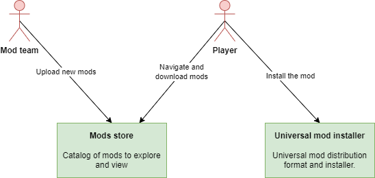
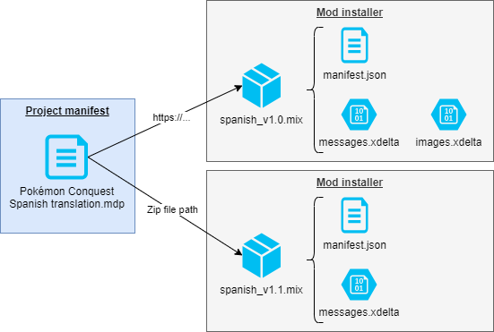
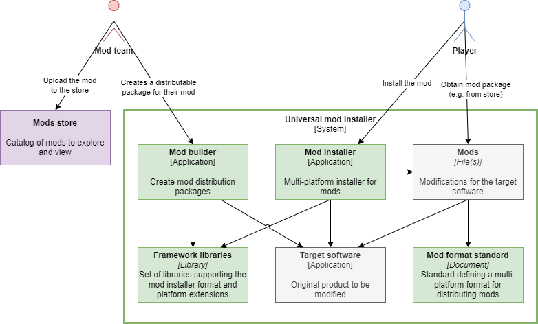

# Specification overview

This project introduces a standard framework to distribute mods of a software
product such as a video-game.

At this moment the distribution of mods is mostly based on publishing a file
with a binary diff and a _readme_ file describing the installation steps and
supported software. Some groups that are lucky to have a developer may be able
to create a _patcher_, a specific software to apply the mod on the game.

The main goal is to provide a common solution for distributing and installing
mods, from any platform, to any platform. This is achieved by introducing two
main new formats:

- **Modding project manifest** (`.modproj`, `.mdp`): text file describing a
  modding project. It contains information of the game and lists the different
  mod versions available of the project.
- **Mod installer eXtensible** (`.mix`): container with the resources of the mod
  and a text file describing the automatic installation process.

The standard format fits in the idea of providing a compatible distribution and
installation of mods. This _modiverse_ would consist of several applications and
libraries.

- _Mod store_: OpenAPI specification that mod catalog webs could implement.
  Desktop / mobile applications would be able to navigate and download mods from
  different compatible webs.

- _Mod builder_: cross-platform application that helps mod teams to create a
  distributable package for their mod (`.mdp` and `.mix` files).

- _Mod installer_: multi-platform that installs compatible mod packages.
